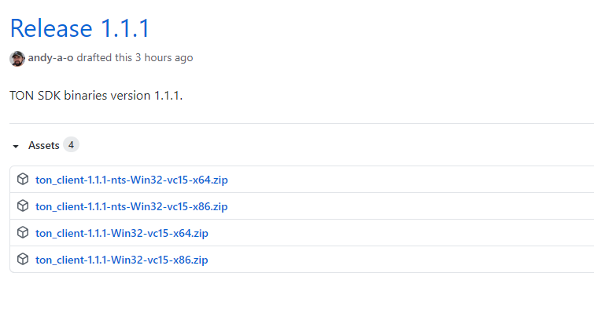

# PHP Extension for TON SDK Wrapper - Installation notes

## Requirements

* PHP 7.4+ or 8.0+ with OpenSSL extension enabled.
* Windows, Linux or macOS.
* For Linux users: OpenSSL 1.1 (dev) and php-devel tools to be installed.
 
You can install this extension using one of the following ways.

### Option 1: PHP installation script

Run this script using the PHP interpreter you wish to add this extension to:

```
php -r "copy('https://raw.githubusercontent.com/radianceteam/ton-client-php-ext/1.33.1/installer.php', 'installer.php');"
php -r "if (hash_file('sha384', 'installer.php') === '03586e200bc1c87f000c5a0eea27aa688eb451a5b946579205ca918bbffda7234359e2d0e176aa53e841c6a77b8de959') { echo 'Installer verified'; } else { echo 'Installer corrupt'; exit(1); } echo PHP_EOL;"
php installer.php -v 1.33.1
php installer.php -v 1.33.1 -T
```

On Linux you may need to run installation step using `sudo`:

```
sudo php installer.php -v 1.33.1
```

The last command `php installer.php -v 1.33.1 -T` is to test the new installation.

In case of any issues please re-run the problematic command with additional arguments `-o install.log -V`
and post new GitHub Issue in this repository with `install.log` file created during installation.

For example:

```
php installer.php -v 1.33.1 -o install.log -V
```

### Option 2: Manual steps

#### Windows

Download Windows binaries from [GitHub Releases](https://github.com/radianceteam/ton-client-php-ext/releases).

How to choose archive version:

 - Check your PHP version:

```
php --version
PHP 7.4.12 (cli) (built: Oct 27 2020 17:18:47) ( ZTS Visual C++ 2017 x64 )
Copyright (c) The PHP Group
Zend Engine v3.4.0, Copyright (c) Zend Technologies
    with Xdebug v2.9.8, Copyright (c) 2002-2020, by Derick Rethans
```

Here, `7.4.12` - your PHP version, `ZTS` means that Thread Safety is enabled and `x64` is a desired platform.

Choose the corresponding archive file from GitHub releases:



Archives containing `nts-` suffix in their names are Non-Thread-Safe, so need to be chosen when ZTS is not enabled.

 - Unpack the archive.
 - Copy `php_ton_client.dll` from the archive to `ext` directory in the PHP installation folder.
 - Copy `pthreadVC2.dll` and `ton_client.dll` from the archive to the PHP installation folder.
 - Modify `php.ini` file located in the PHP installation folder; add new extension:
```
extension="<Full path to php_ton_client.dll>"
```
for example:
```
extension="C:\php\ext\php_ton_client.dll"
```
 - Verify that extension is enabled by inspecting output of `php --info`:
```
php --info > phpinfo.txt 
``` 
open `phpinfo.txt` in your favourite editor and find this line:
```
ton_client

ton_client support => enabled
```
 - All done.

#### Linux/Mac

There's no pre-built binaries for these platforms. You will need to install
extension by building it from sources, as described in [Development notes](DEVELOPMENT.md#linuxmac).

## Troubleshooting

Fire any question to our [Telegram channel](https://t.me/RADIANCE_TON_SDK).
 
## Known issues

 - Windows users may experience "Access denied" errors when installing this extension over the already installed one 
   (like, previous version). Reason is that extension files cannot be removed because they are loaded by the PHP 
   interpreter. Solution is to manually remove `ton_client.dll` and `ext\php_ton_client.dll` files from the PHP 
   installation folder and re-run install.
